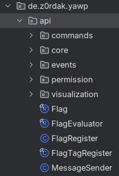

The YAWP API is a way to interact with the mod and its features. It is designed to be used by other mods to interact with the regions and flags of YAWP.

The API is still in development and will be expanded over time. 

If you have any suggestions or ideas for the API, feel free to open an issue on [GitHub](https://github.com/Z0rdak/Yet-Another-World-Protector/issues) or share your idea in the **#suggestions** channel on [Discord](https://discord.com/invite/d7hArKCUtm).

A detailed documentation is still work in progress.

## How to depend on YAWP

To include YAWP as dependency include it by using the `cursemaven` repository.

1. Add the following snippet to your `build.gradle`.
```groovy
repositories {
    maven {
        url "https://cursemaven.com"
    }
}
```

2. Don't forget to add the mod-loader specific dependency.

The cursemaven site explains how to select a specific file: https://www.cursemaven.com/

The format is `curse.maven:yawp-663276:<fileId>`

```groovy
dependencies {    
    //Fabric    
    modImplementation "curse.maven:yawp-663276:6176022"
    
    //Forge
    implementation fg.deobf("curse.maven:yawp-663276:6117986")
    
    //NeoForge
    implementation "curse.maven:yawp-663276:6176016"
}
```

## Where to look

The API is located in the package `de.z0rdak.yawp.api`. 

Please refrain of using other packages beside this one. Because the inner workings might change without notice and/or you might break stuff by using internal classes/methods.



## Structure

### `de.z0rdak.yawp.api.commands` 

Contains 
- constant literals used for/in the commands 
- builders to build commands

### `de.z0rdak.yawp.api.core`

Contains the API for
- the Global Region
- Dimensional Regions
- Local Regions (within the respective Dimensional Region API)
- Builder for areas, regions, flags

### `de.z0rdak.yawp.api.events`

Contains events for flags and regions.

### `de.z0rdak.yawp.api.permission`

Contains helpers to check permissions.

### `de.z0rdak.yawp.api.visualization`

Contains helpers to visualize Local Region areas.

