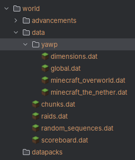

The region data is saved as [NBT](https://minecraft.wiki/w/NBT_format) inside your world’s data directory (see screenshot below).

You can inspect and edit it with external NBT editors, but manual changes are generally a bad idea unless you fully understand the format.

YAWP only does minimal validation when loading this data. Invalid edits can corrupt or erase region information.

## File location

- client (LAN mode): it's located in `<your-world-name>/data/`.
- dedicated server: it's located in `world/data/`.

## Region data structure

The region data is saved across multiple file, all stored in directory called `yawp`.

- `dimensions.dat` : Stores a list of dimensions/levels managed by YAWP.
- `global.dat` : Stores the region data for the [Global Region](../concepts/regions/overview)

Additionally, there is one file, for every dimension/level managed by YAWP. Those are named like the dimension/level itself.

Here you find the region data of the Dimensional Region for this dimension, as well as the Local Regions defined in this dimension.

For the overworld and nether this would be

- `minecraft:overworld` => `minecraft_overworld.dat`
- `minecraft:the_nether` => `minecraft_the_nether.dat`

These files should match the list of the dimensions/levels in the `dimensions.dat` file.

## Region data saving

The region data is saved automatically
- on every command that manipulates region data
- cyclic on set intervals (build in server save auto-save)
- graceful server shutdown/client world close
- running the `/save-all` command 
