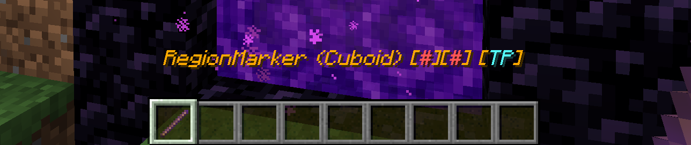

# RegionMarker commands

The RegionMarker are used to mark areas for easy region creation. Right-click two blocks to mark a Cuboid area to create a new region.

The RegionMarker has a tooltip that shows the shape of the region and the marked blocks behind it.

When marking blocks, the RegionMarker name will change and indicate a valid area in the chat.

### RegionMarker without marked blocks

### RegionMarker with marked blocks

## List of commands

* `/yawp marker give` - Gives the player a RegionMarker.
* `/yawp marker reset` - Resets the data of the RegionMarker.
* `/yawp marker create <regionname> [<parent>]` - Creates a new region with the marked area and an optional parent region.

Right-clicking more than two times will again mark the first position, clicking again marks the second, the first, and so on...

You can obtain the RegionMarker by using the command `/yawp marker give` or by renaming a vanilla Stick item in an anvil to 'RegionMarker'.

The command `/yawp marker reset` resets the data of the RegionMarker (e.g. marked blocks) if necessary.

The command `/yawp marker create <regionname> [<parent>]` can be used to create a new region, if the marked area is valid.
See above: [Creating a region with the RegionMarker](marker-commands#creating-a-region-with-the-regionmarker).

***

## Creating a region with the RegionMarker

1. Use the RegionMarker to mark two Blocks, defining the area of the Region.
2. Use the command `/yawp marker create <regionname> [<parent>]` to create a new region. Alternatively click the link in the message that appears after marking the area.

The arguments are explained as follows:
* `<regionname>`: the name of the region you want to create. Duplicate region names in the same dimensions are not allowed.
* `[<parent>]`: the parent argument is optional. It can be used to define set the parent region directly on creating a new region. Leaving parent empty will result in the Dimensional Region being used as parent region.

The CLI only lists Local Regions as potential parents which you own yourself. A new region without a parent argument will be created as a child region of the Dimensional Region you are currently in. This requires the appropriate permission to do so. You either need to be an owner of the Dimensional Region OR you need permissions from the configuration.