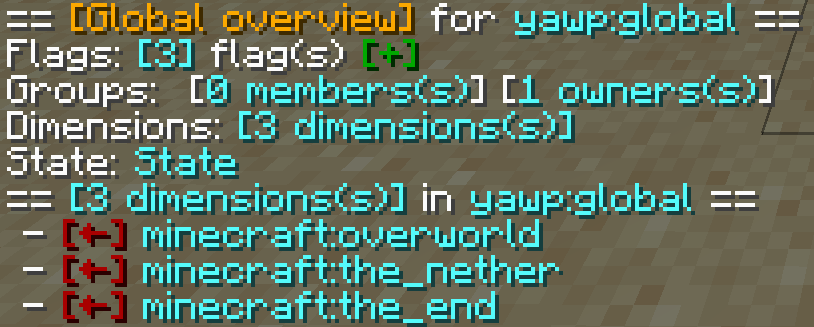

**ONE REGION TO RULE THEM ALL!!!** _cough_..._cough_...  sorry, with that out of the way, let's get serious.

## Overview

The Global Region is present everywhere. It is the region which is parent to **all** Dimensional Regions. 
Most things you are familiar with from Dimensional Regions work the same way with the Global Region.

_(This is what you'll get by typing `/yawp global` or `/yawp global info`)_

In the CLI info about the Global Region you see what you would expect from any other region with some minor changes. 

- Since the Global Region has no parents, there are no responsible flags passed down from parent regions. 

- Instead of listing the child regions, there is a dedicated entry for the Dimensional Regions, which when clicking on it, 
will prompt a pagination listing all the Dimensional Regions managed by YAWP.

When looking at the state of the Global Regions you'll find an option to disable the Global Region and to mute its flag alerts.

## Creation

You don't. It is created during the initial server start. The Global Region is always there and, by default, active but not configured otherwise. 

## Managing

The Global Region, as the other regions, can be managed only by its region owners, or by players which have the required [permission](../../config/permissions).

To manage the Global Region, use the `/yawp global [info]` command. This will show you the interactive info of the Global Region.

For a more detailed overview of the commands for the global region take a look at [Global Region Commands](../../commands/region/global-commands).