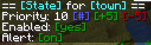
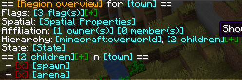

## Hierarchy

YAWP provides three different types of regions to protect your server. Their common properties are explained in the following sections.
***
## Groups

**Owners** - have full control over the region. They can manage flags, members, and children. Owners can also manage the
state of the region. Since 0.0.4.0-beta1, there is also a config option to enable hierarchical ownership for child
regions (see: [Config](../../config/permissions)).

**Members** - Members can bypass flags set in the region. They can't manage the region itself.

These groups can be individual players or a [team](https://minecraft.fandom.com/wiki/Commands/team) or both.

You will be able to define own groups **in the future**, each with different permissions.
***
## Flags

Flags are rules you can add to regions. If the flag is initially defined, it prevents the defined action associated with the flag.

Flags can be added and removed like for the Dimensional Regions. The CLI allows easy removal and adding via interactive links.

The picture shows a flag list of a Dimensional Region, but this is equivalent for Local Regions or the Global Region

For more details about flag management, take a look at the [Flags](../flags/overview) page.

***
## State

The state of a region includes the enabled state and the alert state. If the enabled state is off, the flags are all deactivated. 
The alert state enables and disables messages sent to the player to inform them that a specific action is denied by a flag in this region.

Local Regions also have a priority to manage overlapping regions. The higher the number, the higher the regions' priority.
***
## Hierarchy

Local Regions can have a parent. Whenever a new Local Region is created without supplying a parent region, 
the parent is set to the Dimensional Region which the new Local Region is created in.

Local Regions can also have child regions. The children of a Local Regions need to be contained in the area of the parent region. 
The region hierarchy also defines the region priorities. Child regions always must have a higher priority than their parent.

Dimensional Regions always have the Global Region as a parent, and thus the Global Region all Dimensional Regions as child regions.

## How is the region data stored?

Take a look [here](../../advanced/region-data.md)