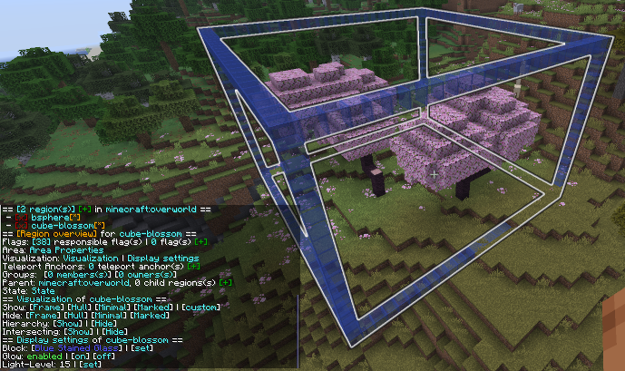

With Local Regions you are able to define areas in your world, which you want to protect from certain actions/events, 
which are caused by players, other entities or the environment.

The area of a region is defined by a Cuboid shape (more shapes are planned for the future!). They also have a priority to manage overlapping regions.

The flags defined in the region only work in this confined area. The properties of Local Regions, 
which distinct them from the other region types are described below.

Sphere:

Cuboid:

***
## Area Properties

The Area Properties of a region describe the area the region is restricted to, the teleport position, 
the marked blocks to define the region area and lastly the type of the area.

The AreaType defines the shape of the region. The currently supported shapes are Cuboids and Spheres. 
Future updates will bring more AreaTypes like Cylinder, Prism and Polygon shapes.

### Shape definitions

- Cuboid areas are defined by marking/supplying the diagonal opposite corner blocks.
  

- Sphere areas are defined by marking/supplying the center block and the radius of the sphere.
  

### Display settings

### Visualization

## Teleport Anchors

## Overlapping regions

Beside having child regions, you will sometimes have overlapping regions which are not directly related as parent or child. 
These overlapping regions do need to have different priorities to work properly.

If a region is overlapping with another region, you'll need to adjust the priority for them to make the flags work properly.

**The higher the number, the higher the regions' priority.**

## Related [Commands](../../commands/region/local-commands)

- [Creating a region](../../commands/region/dimension-commands#creating-a-region-with-the-cli)
- [Expanding the area](../../commands/region/local-commands#area-commands)
- [Setting the area](../../commands/region/local-commands#area-commands)
- [Setting the teleport position](../../commands/region/local-commands#area-commands)