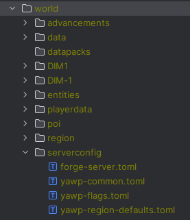

The configuration is split in different files, covering different topics.

* 🔒 `yawp-common.toml` - command and other permission configuration [ ➡️](permissions)
* 🏳️ `yawp-flags.toml` - specific flags configuration, which is not yet covered in region data [ ➡️](flag)
* 📝 `yawp-logging.toml` - logging configuration for flag check and flag check results [ ➡️](logging)
* 🌍 `yawp-region-defaults.toml` - default region properties configuration [ ➡️](region-defaults)
* ⚙️ `yawp-features.toml` - enable/disable yawp features [ ➡️](features)

## Config file location

YAWP uses [ForgeConfigAPIPort](https://www.curseforge.com/minecraft/mc-mods/forge-config-api-port-fabric) to have one 
unified implementation across Forge, Fabric and NeoForge.

The configuration of YAWP is completely server sided. The config files are located in:

- **Forge/NeoForge**: `.minecraft/saves/<world>/serverconfig` (per-world)
- **Fabric**: `.minecraft/config`

_Note that the default config file location of server configs is changed to `.minecraft/config` by FCAP on Fabric 
while still allowing for manual per-world overrides via `.minecraft/saves/<world>/serverconfig`._

See: [ForgeConfigAPIPort Wiki](https://github.com/Fuzss/forgeconfigapiport/wiki/Understanding-ModConfig-Types#server-config-type)

